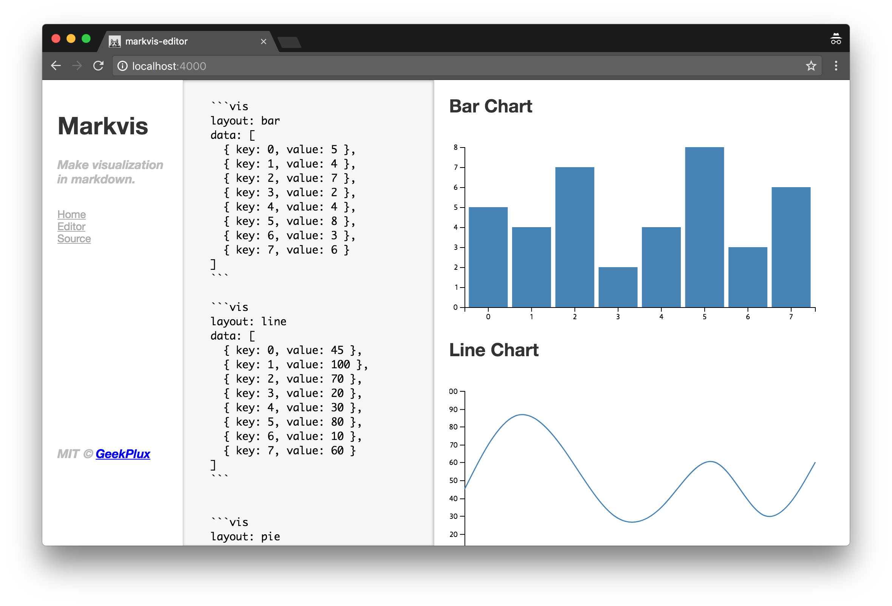

  

# [markvis-editor](https://markvis-editor.js.org)

> a web markdown editor for [markvis](https://github.com/geekplux/markvis)

You can have a try [online](https://markvis-editor.js.org)

## Preview

## License

**markvis-editor** © [geekplux](https://github.com/geekplux), Released under the [MIT](./LICENSE) License. 
Authored and maintained by geekplux with help from contributors ([list](https://github.com/geekplux/markvis-editor/contributors)).

> [geekplux.com](github.com/geekplux) · GitHub [@geekplux](https://github.com/geekplux) · Twitter [@geekplux](https://twitter.com/geekplux)
